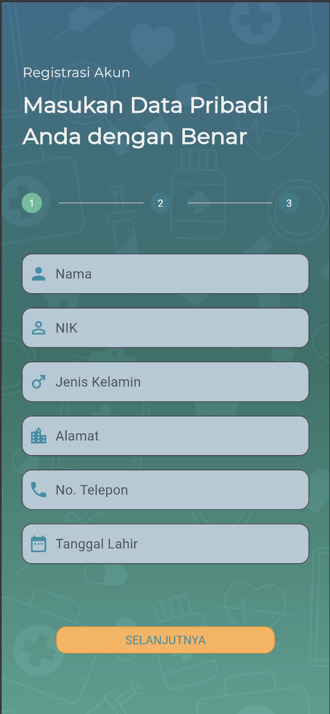
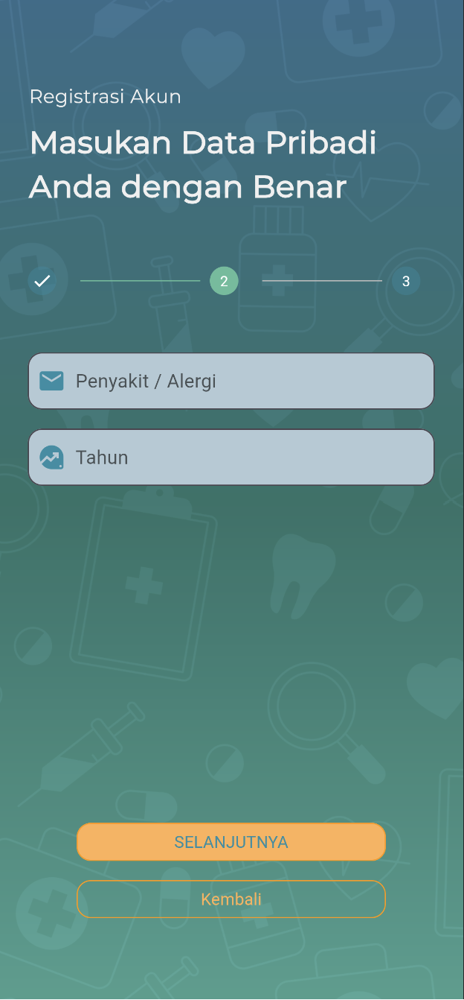
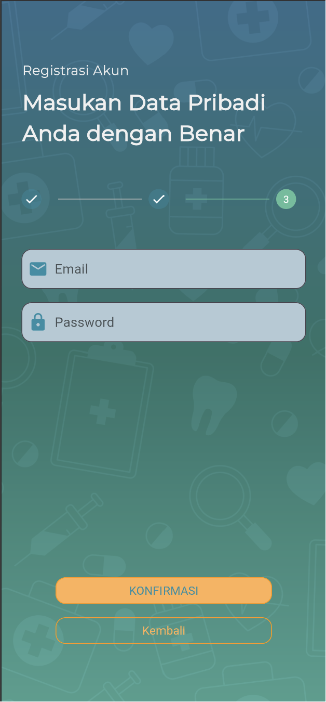

# TP2-Provis

## DigiSehat

### Deskripsi Proses Registrasi

Proses registrasi pada aplikasi "DigiSehat" dirancang untuk memastikan bahwa pengguna dapat dengan mudah membuat akun dan memasukkan data pribadi mereka dengan cara yang aman dan terpercaya. Proses ini meliputi beberapa langkah yang memandu pengguna melalui pengisian formulir yang diperlukan untuk memulai pengalaman rawat jalan mereka. Tujuan dari desain ini adalah untuk mengumpulkan informasi yang relevan dari pengguna dengan cara yang terstruktur dan user-friendly.

## Halaman Registrasi

### Langkah 1: Data Pribadi

Pada langkah pertama, pengguna diminta untuk mengisi informasi dasar seperti nama, NIK, jenis kelamin, alamat, nomor telepon, dan tanggal lahir. Halaman ini dirancang dengan fokus pada kemudahan penggunaan.

### Langkah 2: Informasi Kesehatan

Pada langkah kedua, pengguna diminta untuk menyediakan informasi tentang riwayat kesehatan, termasuk penyakit atau alergi yang pernah atau sedang dialami, serta tahun terjadinya.

### Langkah 3: Akun Pengguna

Pada langkah terakhir, pengguna harus memasukkan informasi akun seperti alamat email dan password untuk keamanan akun mereka. Halaman ini juga memungkinkan pengguna untuk mengonfirmasi data yang telah dimasukkan sebelum akhirnya menyelesaikan proses pendaftaran.
